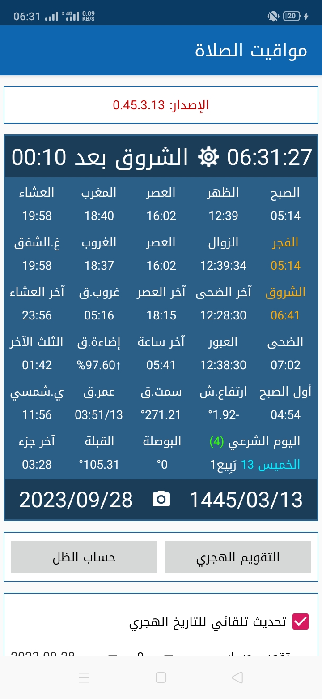
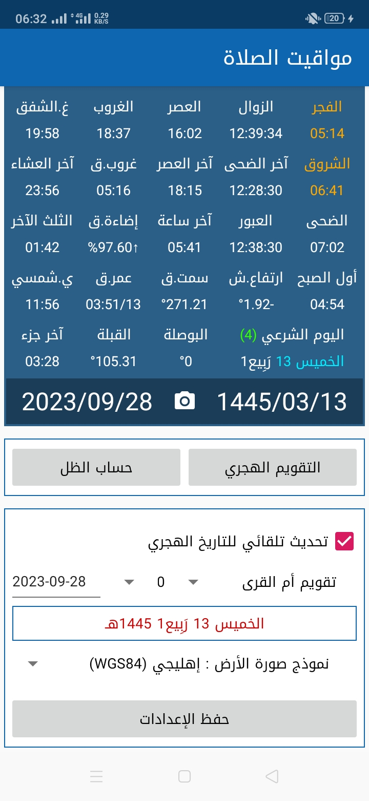
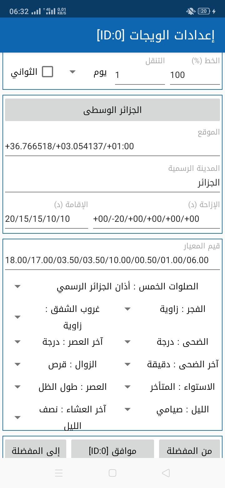
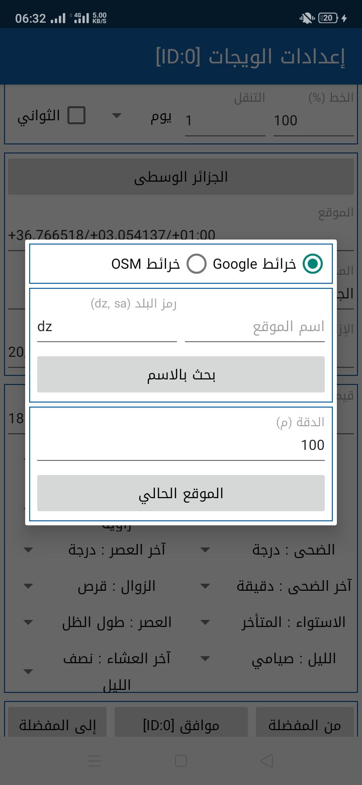
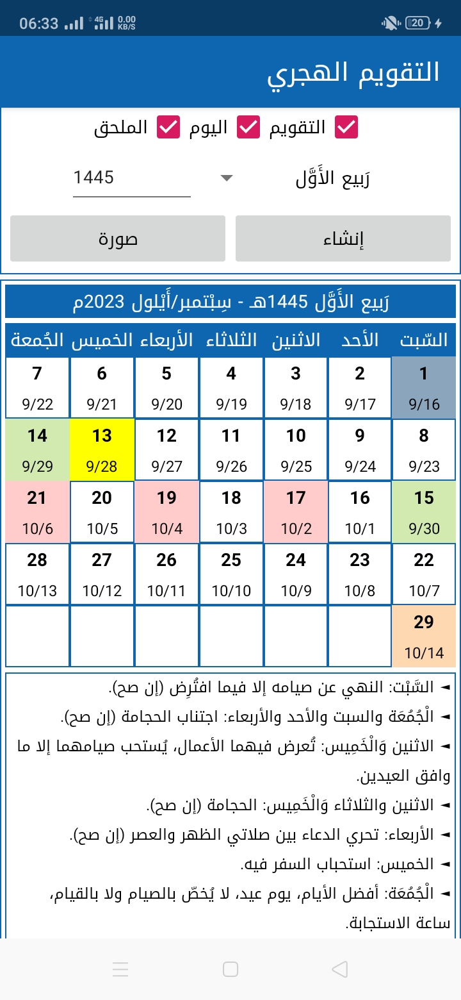
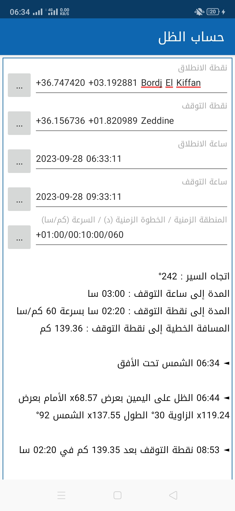

# PrayerTimes

**PrayerTimes** is a public-domain application that provides prayer times.

## Screenshots :

|  |  |  |  |  |  |
|--|--|--|--|--|--|

## TODO :

- add forceResultsForToday to get correct rise/set/transit moon times for today not yesterday or tomorrow
when timezone is different then UTC.
search forceResultsForToday on http://conga.oan.es/~alonso/doku.php?id=blog:sun_moon_position
